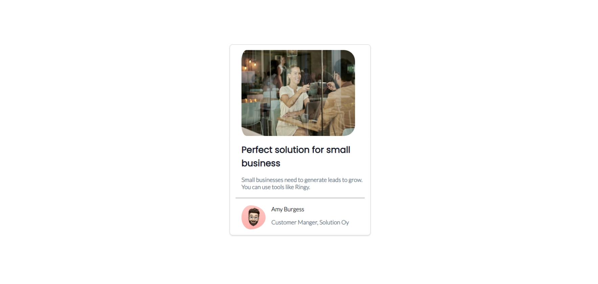

# Tarjeta de Negocios de Blog
La Tarjeta de Negocios de Blog es una herramienta eficaz para presentar tus blogs o contenidos de manera profesional y atractiva. Esta tarjeta está diseñada para ayudarte a destacar tu blog y atraer a nuevos lectores o colaboradores potenciales.

## Características

- **Diseño Profesional**: La tarjeta presenta un diseño profesional que enfatiza la marca de tu blog. Puedes personalizar el logotipo y los colores para que coincidan con la identidad de tu blog.

- **Información Clave**: Incluye información esencial sobre tu blog, como el nombre, el lema, una breve descripción y los enlaces a tus redes sociales y sitio web.

- **Optimizada para Redes Sociales**: La tarjeta se ve genial cuando se comparte en redes sociales, lo que puede aumentar la visibilidad de tu blog.

- **Fácil de Personalizar**: Puedes personalizar fácilmente el contenido y los estilos de la tarjeta para que se adapte a tu marca y a tus preferencias.

## Cómo Integrar

Integrar esta Tarjeta de Negocios de Blog en tu sitio web o en tus correos electrónicos es un proceso sencillo:

1. Clona o descarga este repositorio en tu máquina local.

2. Agrega el código HTML y CSS proporcionado en tu sitio web o correos electrónicos donde desees mostrar la Tarjeta de Negocios de Blog.

3. Asegúrate de que los estilos CSS se vinculen correctamente y de que las rutas de las imágenes y los enlaces sean precisos.

4. Personaliza el contenido con los detalles de tu blog, como el nombre, el lema, la descripción y los enlaces a tus redes sociales.

5. Asegúrate de que los enlaces a tus perfiles de redes sociales y a tu sitio web se actualicen con la información correcta.

## Cómo Contribuir

Si deseas contribuir al desarrollo de esta Tarjeta de Negocios de Blog, no dudes en realizar un "fork" de este repositorio. Puedes enviar sugerencias, correcciones de errores o mejoras a través de "pull requests." Estamos abiertos a colaboraciones que ayuden a mejorar esta herramienta para la comunidad.

## Autor
Esta tarjeta minimalista de blog fue creada por Juan DIego Sastre Moreno

Si tienes alguna pregunta o necesitas ayuda, no dudes en ponerte en contacto conmigo.

## Redes
Twitter: @Diegodev10